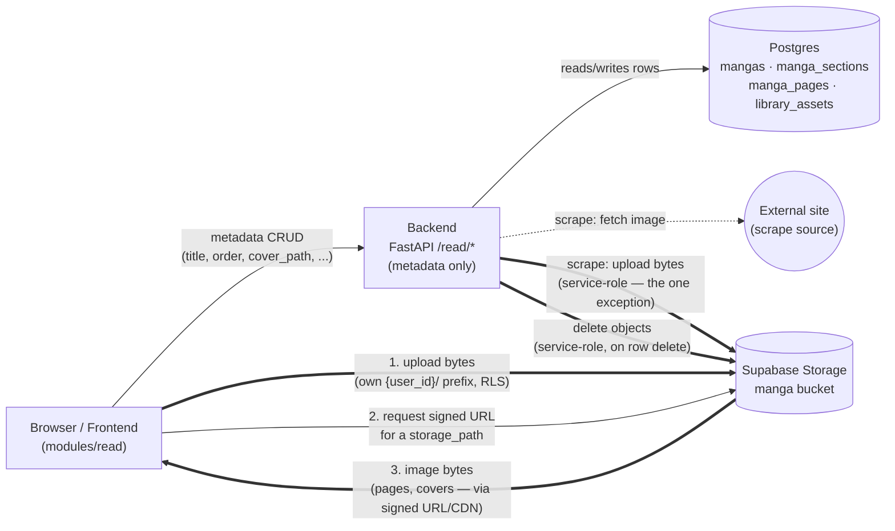

# Module: `read`

> Per-module architecture doc for the manga-reader backend (code-level module name:
> **`read`**; **"Lector"** is the frontend display label only). Mirrors the chat
> module's doc. Read `../backend_guidelines.md` first — in particular its `shared/`
> section, which now includes the Storage client this module depends on.

## Status

**Proposal.** Agreed design, not yet built. Pairs with `supabase/docs/modules/read.md`
(tables + bucket) and `frontend/docs/modules/read.md` (UI + direct-to-storage).

## Responsibility

The `read` module owns one business capability: **managing a user's manga library —
series, their volumes/chapters, and the ordered page images** — including importing
pages by scraping an external site, and a per-user **staging pool** of scraped/uploaded
images that haven't been organized into a series yet.

The pool lives here (not a separate `utils`/`temp` module) because it has no seam to
cut along: its producer is this module's `scraper.py` (and direct uploads this module
already handles), its store is this module's `manga` bucket, and its *only* consumer is
this module's organize step (pool asset → `manga_page`). A module whose producer,
storage, and sole consumer are all `read` is one feature, not two.

It does **not** own:
- Storing the image **bytes** → that's Supabase **Storage** (the `manga` bucket). This
  module stores only **metadata rows** (paths, order) and, for scrape-import, relays
  bytes into Storage via the `shared/storage/` client. Local-upload bytes never touch
  the backend — the frontend uploads them straight to Storage (see *Upload flows*).
- Authentication / "who is the user" → `modules/auth`'s public surface
  (`get_current_user`).
- Configuration → `core/config.py`.

---

## Structure

```
backend/app/modules/read/
├── __init__.py
├── router.py            # HTTP endpoints: /read/mangas*, /read/sections*, /read/pages*, /read/library*, /scrape, /import
├── repository.py        # ReadRepository — all DB access (mangas/sections/pages/library), user-scoped
├── models.py            # Manga, MangaSection, MangaPage, LibraryAsset ORM (Supabase-migrated tables)
├── scraper.py           # Extracted component — fetch a page URL, extract image candidates
├── dependencies.py      # DI: get_read_service / get_scrape_service
├── schemas/             # API-boundary shapes, grouped by purpose (package)
│   ├── __init__.py      #   public surface — re-exports; lists request vs response
│   ├── manga.py         #   MangaCreate/Update (req) · MangaSummary/Detail (resp)
│   ├── section.py       #   SectionCreate (req) · SectionSummary (resp)
│   ├── page.py          #   PageRecord/ReorderRequest (req) · PageInfo (resp)
│   ├── library.py       #   LibraryAssetRecord/OrganizeRequest (req) · LibraryAssetInfo (resp)
│   └── scrape.py        #   ScrapeRequest/ImportRequest (req) · ScrapeResult (resp)
└── services/            # Service layer — one scope per file
    ├── __init__.py
    ├── read.py          #   ReadService — CRUD over mangas/sections/pages + reorder + pool organize/discard + file cleanup
    └── scrape.py        #   ScrapeService — fetch+extract, then import (download → Storage) to a section or the pool
```

`models.py` is an ORM **mirror** of the migration-defined tables (FK into `auth.users`
+ RLS ⇒ owned by Supabase migrations, not `create_all`) — same rule as chat.

---

## File-by-File

### `router.py` — HTTP boundary (thin)
`APIRouter(tags=["read"])`. Every handler resolves its service via `Depends` and
delegates — no branching here.

| Method & path | Service call |
|---|---|
| `GET /read/mangas` | `ReadService.list_mangas()` |
| `POST /read/mangas` | `ReadService.create_manga(body)` |
| `GET /read/mangas/{id}` | `ReadService.get_manga(id)` → 404 if not owned (includes its sections) |
| `PATCH /read/mangas/{id}` | `ReadService.update_manga(id, body)` |
| `DELETE /read/mangas/{id}` | `ReadService.delete_manga(id)` (also deletes its Storage files) |
| `POST /read/mangas/{id}/sections` | `ReadService.create_section(id, body)` |
| `DELETE /read/sections/{id}` | `ReadService.delete_section(id)` (+ Storage files) |
| `GET /read/sections/{id}/pages` | `ReadService.list_pages(id)` → ordered `PageInfo[]` |
| `POST /read/sections/{id}/pages` | `ReadService.record_pages(id, body)` — persist rows for already-uploaded files |
| `PATCH /read/sections/{id}/pages/order` | `ReadService.reorder_pages(id, body)` |
| `POST /read/scrape` | `ScrapeService.scrape(url)` → candidate image URLs |
| `POST /read/sections/{id}/import` | `ScrapeService.import_into(id, body)` — download + upload + record (straight into a section) |
| `GET /read/library` | `ReadService.list_library()` → the user's pool, oldest-first |
| `POST /read/library` | `ReadService.record_library_assets(body)` — persist rows for pool files the frontend already uploaded |
| `POST /read/library/import` | `ScrapeService.import_to_library(body)` — download chosen scrape candidates into the pool |
| `POST /read/sections/{id}/pages/from-library` | `ReadService.organize_from_library(id, body)` — move ordered pool assets into a section |
| `DELETE /read/library/{id}` | `ReadService.discard_library_asset(id)` (also deletes the Storage file) |

### `services/read.py` — `ReadService` (request-scoped)
CRUD + reorder over the four tables, scoped to `user.id` on every query (the
defense-in-depth note in the schema doc applies — ownership is enforced **here**, not
by table RLS). On manga/section/page deletes it also removes the corresponding objects
from the `manga` bucket via the `shared/storage/` client (the DB cascade drops rows
only, not files). `record_pages` writes the `manga_pages` rows for files the **frontend
already uploaded** to Storage — the request carries `[{storage_path, position, width,
height}]`; the service validates the paths sit under this user's prefix before
inserting.

It also owns the **pool** side (`library_assets`):
- `list_library()` — the user's unassigned pool, oldest-first (a collection queue —
  freshly collected images appear at the bottom).
- `record_library_assets(body)` — the pool twin of `record_pages`: writes rows for
  files the frontend uploaded straight to `{user_id}/_pool/…` (validates the prefix).
- `organize_from_library(section_id, ordered_asset_ids)` — the pool → section move. For
  each chosen asset (in the given order) it inserts a `manga_pages` row pointing at the
  asset's existing `storage_path` and deletes the `library_assets` row, in **one
  transaction**. The Storage object is **not** touched — ownership transfers from the
  pool row to the page row (the path stays valid; see the schema doc's bucket note).
- `discard_library_asset(id)` — drop an unused pool asset: delete the row **and** its
  Storage object (unlike organize, this one *does* remove the file).

### `services/scrape.py` — `ScrapeService` (request-scoped)
Deliberately split across requests so the user picks in between:
1. `scrape(url)` — delegate to `scraper.py` to fetch + extract candidate image URLs,
   return them (with dimensions/preview where available). No persistence.
2. `import_into(section_id, ordered_urls)` — the **direct** path: for each chosen URL,
   download the image **server-side** (browsers can't fetch cross-origin/hotlink-
   protected images), upload it to the `manga` bucket under the user's section prefix
   via `shared/storage/` (service-role), then record the `manga_pages` row in order.
3. `import_to_library(urls)` — the **pool** path (the decoupled flow): same
   server-side download + service-role upload, but writes to `{user_id}/_pool/…` and
   records `library_assets` rows instead of pages. This is what lets a user scrape
   across many sessions into one pool, then organize later via
   `ReadService.organize_from_library`. Both import paths share the same
   download+upload helper — only the destination prefix and the table differ.

### `scraper.py` — extracted component
Owns the fetch + HTML-parsing complexity (its own testable invariants ⇒ Component
Extraction). Uses `httpx` + a fast parser (`selectolax`). Handles lazy-loaded images
(`data-src`, `srcset`, `<picture><source>`), image lists embedded as JSON in
`<script>` or in an HTML **attribute** (Inertia.js `data-page`, etc. — a raw-HTML
fallback used only when the structured passes find nothing), and **HTMX-rendered
readers** — pages whose images load from a separate
`hx-get` fragment fired on `load` (e.g. WeebCentral): `scrape()` follows those
fragments in the same session, sending the `HX-Request` header and the `hx-include`
params (with defaults for client-only state like `reading_style`) the endpoint
requires. Sends a browser `User-Agent` so Cloudflare/CDNs don't reject it. Ships a
generic extractor; per-site extractors can be added behind the same interface later.

> **Responsible-use note.** Scraping re-hosts third-party images; only content the user
> is authorized to copy should be imported. Respecting each site's ToS/robots is the
> user's responsibility — the component stays generic and adds no evasion.

### `repository.py` — `ReadRepository`
All DB access for the four tables, every method filtering/joining on ownership:
`list_mangas(user_id)`, `get_manga(id, user_id)`, `create_manga`, `update_manga`,
`delete_manga`, `create_section`, `delete_section`, `list_pages(section_id)`,
`insert_pages(rows)`, `set_positions(...)`, plus the pool:
`list_library(user_id)`, `insert_library_assets(rows)`, `get_library_assets(ids,
user_id)`, `delete_library_assets(ids, user_id)`. `organize_from_library` composes
`get_library_assets` + `insert_pages` + `delete_library_assets` in one transaction.
Returns `None`/empty when not owned so the router maps to 404.

### `models.py` — ORM mirror
`Manga`, `MangaSection`, `MangaPage`, `LibraryAsset` — typed views of the
migration-defined tables, nothing more (the tables, FKs, RLS, and bucket live in
`supabase/migrations/`).

### `schemas/` — API boundary (package, grouped by purpose)
Import from `modules.read.schemas`. Requests carry only what the client sends (e.g.
`PageRecord` = `storage_path` + `position` + dims; `LibraryAssetRecord` =
`storage_path` + optional `source_url` + dims; `OrganizeRequest` = ordered
`asset_ids`); responses are the stored shapes (`PageInfo`/`LibraryAssetInfo` add the
id; the reader/pool grid resolve bytes via signed URLs themselves — see below).

### `dependencies.py` — DI surface
`get_read_service` / `get_scrape_service` build their request-scoped service from a
fresh `AsyncSession`, the current user (`modules.auth`), and the singleton Storage
client off `app.state`.

---

## Storage — bytes vs metadata

This module is the **metadata** authority; **Supabase Storage** holds the bytes.



Thick (`==>`) edges are the ones that actually move image bytes — notice almost all of
them are Browser ↔ Storage direct, with the backend only stepping into that path for
scrape-import and cleanup-on-delete (both service-role, both called out in the bullets
below). The thin edges are metadata-only: step 2 is just "give me a signed URL for this
path" (a request, no bytes), and the constant thing the backend actually does is the
`Browser → Backend → Postgres` metadata line at the top.

- **Local upload:** frontend uploads files **directly to Storage** (RLS-gated by owner
  path), then calls `POST /read/sections/{id}/pages` (into a section) or `POST
  /read/library` (into the pool) so this module records the rows. No image bytes pass
  through the backend.
- **Scrape import:** the backend downloads + uploads server-side (the only path where
  bytes flow through the backend), using the **service-role key** via `shared/storage/`
  — either straight into a section (`/read/sections/{id}/import`) or into the pool
  (`/read/library/import`).
- **Organize (pool → section):** metadata-only. The page row reuses the pool object's
  existing `_pool/` path, so **no bytes move** — the backend just swaps a
  `library_assets` row for a `manga_pages` row in one transaction.
- **Reading / browsing the pool:** the frontend mints batch **signed URLs** for a
  section's pages (or the pool's assets) directly from Storage (RLS-gated) and loads
  them from the CDN — the backend serves only the ordered/listed metadata (`GET
  /read/sections/{id}/pages`, `GET /read/library`), not the images.

New `core/config.py` keys (server-only): `SUPABASE_SERVICE_ROLE_KEY` (**secret — never
exposed to the frontend**) and `MANGA_BUCKET` (default `"manga"`). New deps:
`selectolax` (HTML parsing) and `httpx` (fetch/download) — see `shared/storage/` in the
backend guidelines for the Storage client itself.

---

## Dependency flow (downward only)

```
modules/read/router.py
    ├─→ modules/auth/dependencies.py (get_current_user)            # public surface
    ├─→ modules/read/services/read.py (ReadService)
    │       ├─→ modules/read/repository.py (ReadRepository) ─→ core/database (AsyncSession)
    │       │       # mangas/sections/pages + library_assets (pool); organize = one txn
    │       └─→ shared/storage/ (delete objects on page/manga/section delete or pool discard)
    └─→ modules/read/services/scrape.py (ScrapeService)
            ├─→ modules/read/scraper.py (httpx + selectolax → image candidates)
            ├─→ modules/read/repository.py (record imported pages OR pool assets)
            └─→ shared/storage/ (upload downloaded images, service-role)
```

`read` imports from `shared/`, `core/`, and `modules/auth`'s public surface only.

---

## Future

- Thumbnail generation (Supabase image transforms) for grid/cover views.
- Reading-progress persistence (`last_position` per section) once the reader lands.
- Pagination on the library + page lists once volumes grow.
- Per-site scrape extractors behind the generic one.
